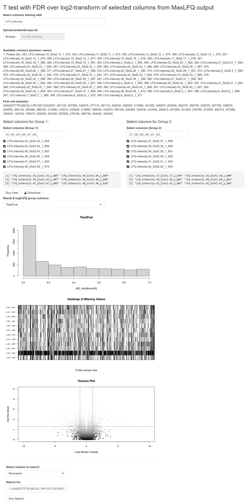

# Differential Expression Analysis App (Shiny)

This is a Shiny/R application for differential-expression analysis using T-test followed by Benjamini Hochberg correction (FDR). The app is designed with base-R for proteomics data (MaxLFQ output) and supports quick group-wise comparison with FDR, CV, histograms, missing-value histogram and further result exploration.

---

## Features

- Upload or use a default `proteinGroups.txt` file (tab-separated, MaxLFQ output)
- Dynamically select columns for two groups using prefix and filter patterns
- Default group filters for quick start (e.g., `43_|44_|45_|46_|47_|48_` and `37_|38_|39_|40_|41_|42_`)
- Interactive selection of columns for each group
- Real-time display of available columns and sample data
- Row-wise t-test (via custom `testT` function) between selected groups
- Download results with filename encoding all selection/filter parameters
- Downloaded filename format: 
	`proteinGroups_SEL-<selection>_G1-<group1filter>_G2-<group2filter>_testT.csv`
	(all non-alphanumeric characters removed from selection/filter strings)
- Interactive table, histogram, and heatmap of selected data

---

## Step-by-Step Usage

### 1. Setup

#### Requirements
- R (>= 4.0 recommended)

#### Install dependencies
```r
install.packages('shiny')
```

#### Clone the repository
```bash
git clone https://github.com/animesh/diffExpr
cd diffExpr
Rscript -e "shiny::runApp('app.R', host='0.0.0.0', port=8081)"
```

tested with proteinGroups.txt from [Proteomics profiling in primary tumors of metastatic and non-metastatic breast cancers](https://www.ebi.ac.uk/pride/archive/projects/PXD037288) results

```bash
wget https://ftp.pride.ebi.ac.uk/pride/data/archive/2023/03/PXD037288/txt.zip
unzip txt.zip
```

where *T67* is *Groups 1* is representing samples *43_|44_|45_|46_|47_|48_* (note that individual samples at separated by pipe) and samples representing *Group 2*/T66 are is *37_|38_|39_|40_|41_|42_*, the results downloaded for this comparison in above zip file proteinGroups.txtLFQ.intensity.112T67T660.050.50.05tTestBH.csv should match with the ones Downloaded from this analysis, proteinGroups_SEL-LFQ_intensity_G1-43_44_45_46_47_48_G2-37_38_39_40_41_42_testT.csv  


### Credits

There are several Shiny apps for such that have served as a source of inspiration, like:

-[VolcanoR](https://github.com/vovalive/volcanoR)

-[Volcanoshiny](https://github.com/hardingnj/volcanoshiny)

-[VolcanoPlot_shiny_app](https://github.com/stemicha/VolcanoPlot_shiny_app)


fork: VolcaNoseR is created and maintained by Joachim Goedhart ([@joachimgoedhart](https://twitter.com/joachimgoedhart))

### [shiny app](https://fuzzylife.shinyapps.io/diffExpr/) running online

Standard output generated with the example data:


Screenshot_2-9-2025_193514_fuzzylife.shinyapps.io.jpeg



